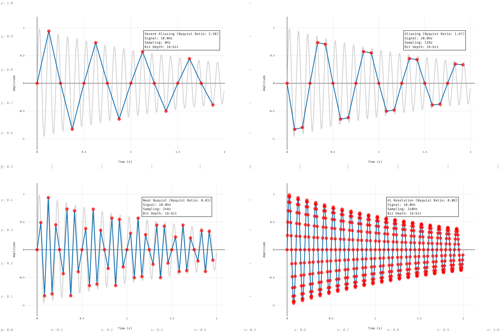

# Digital Audio Sampling Visualization Study with Plotly.rs

This is a study project to explore the graph visualization capabilities of Plotly for Rust (plotly.rs). As a case study, it creates a comparison visualization of audio signal sampling with different sampling rates and bit depths.



## Overview

The project demonstrates the relationship between sampling frequency and signal reconstruction in digital audio processing. It visualizes how different sampling rates affect signal quality, from severe aliasing to high-resolution sampling.

## Technical Details

### Key Components

#### SignalParams Structure
```rust
struct SignalParams {
    name: String,
    signal_freq: f64,    // Input signal frequency (Hz)
    sampling_rate: i64,  // Sampling frequency (Hz)
    bit_depth: u32,      // Quantization bit depth
    nyquist_ratio: f64,  // Ratio to Nyquist frequency
}
```

This structure holds the parameters for each signal visualization scenario.

#### Main Visualization Features

- Generates decaying sine waves as the original continuous signal
- Applies sampling and quantization based on specified parameters
- Creates a 2x2 subplot layout showing different sampling scenarios
- Includes detailed annotations and guides for precise measurement

### Visualization Scenarios

The code demonstrates four different sampling scenarios:
1. Severe Aliasing (8Hz sampling rate)
2. Aliasing (12Hz sampling rate)
3. Near Nyquist (24Hz sampling rate)
4. High Resolution (240Hz sampling rate)

All scenarios use a 10Hz input signal and 16-bit quantization.

## Implementation Highlights

- Uses exponential decay to create a more realistic audio signal simulation
- Implements custom grid guides for precise measurements
- Features detailed subplot annotations with technical parameters
- Employs high-resolution continuous signal plotting with interpolation

## Dependencies

```toml
[dependencies]
plotly = "0.8.3"
```

## Usage

To run the visualization:

```bash
cargo run
```

This will generate a PNG file in the `export` directory named `digital_audio_comparison.png`.

## Future Improvements

- Add frequency domain analysis
- Implement interactive controls for signal parameters
- Add more sampling and quantization scenarios
- Include noise and filtering effects

## Contributing

Feel free to contribute to this study project by submitting issues or pull requests. This is an educational project aimed at helping others understand both digital signal processing concepts and data visualization with Rust.

## License

[MIT License](LICENSE)
